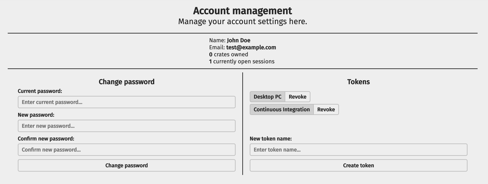

API Authentication
==================

Authentication in the programmatic API is handled a bit differently than in the frontend.  
While the frontend uses session cookies to authenticate users, the programmatic API relies on a **token** passed using the **`Authorization`** HTTP request header.  
This is done as specified by [**Cargo's alternative registries documentation**](https://doc.rust-lang.org/cargo/reference/registries.html#web-api).  

How to get a token
------------------

There are multiple ways to get an authentication token from the registry.

**Using the frontend:**

If you're using Alexandrie with the frontend enabled, you can go to your instance's frontend, log in to your account and go to your Account Management page.  
From there, you have the option to generate an authentication token for your account and/or revoke existing tokens.  

**Using the programmatic API:**

There are three ways of getting a token in the programmatic API, depending of what you want to do.  

**If you don't have any account yet**, creating an account using the [**Account Registration endpoint**](account/register/post.md) will grant you with an authentication token for the newly created account.

**If you already have an account in the registry**, logging in using [**Account Login endpoint**](account/login/post.md) will also grant you an authentication token.

**If you are already logged in** (meaning you already have a token), you can ask the registry to issue a new separate token for your account using the [**Token Generation endpoint**](account/tokens/put.md).

How to use a token
------------------

To access an authenticated endpoint using a token, all you need to do is to make the request with the token as the `Authorization` header's value.  

So, if your token is `foobar`, the request must be made with the `Authorization: foobar` request header.  

**Important note:**  
**The `Authorization` header's value should not contain anything else than the token (no `Bearer` or `Basic` should be present before it, just the plain token).**
